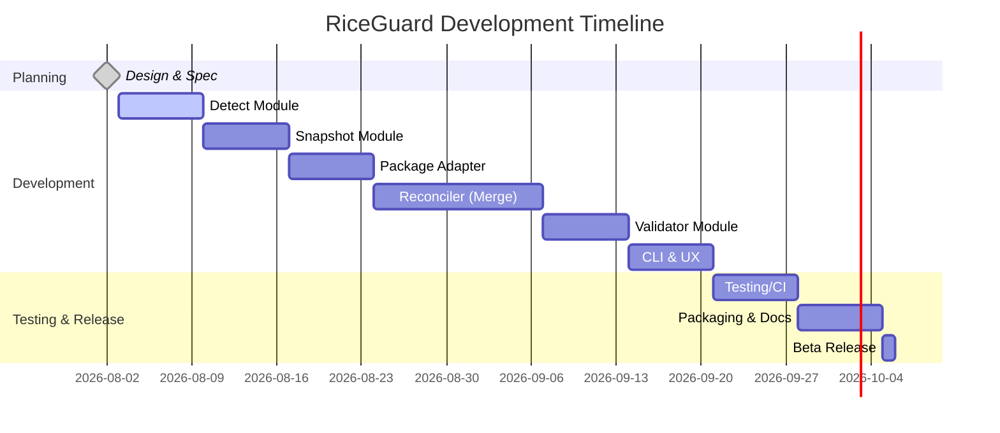

# RiceGuard: Protecting Linux Desktop “Rice” During System Updates

**Executive Summary:** Linux users who “rice” (customize) their desktop – especially Hyprland/Wayland enthusiasts – often lose their custom configs when applying system updates. Traditional dotfile managers (Chezmoi, Stow, Dotbot) synchronize config files but don’t hook into the update process, while snapshot tools (Timeshift, Snapper) back up entire systems. We propose a dedicated CLI tool (codename *RiceGuard*) that intercepts package updates, snapshots user config files (Hyprland, Waybar, Kitty, Wofi, etc.), runs the update, and then reconciles any config changes. Unlike existing dotfile managers, RiceGuard focuses on **safe updates**: it never overwrites user files without saving them, and it can interactively resolve conflicts if an update changes default configs. Initial scope: Ubuntu/Debian with `apt`, targeting Hyprland desktops (plus common rice apps). In future, it could support other distros (Arch `pacman`, Fedora `dnf`) and DEs (Sway, i3, etc.). We recommend Python for rapid development (rich libraries and ease of use) versus a compiled language for a single-binary (`chezmoi` is a Go example). The tool’s architecture will consist of modules for *environment detection*, *snapshot/manifest*, *package-manager adapters*, *diff/merge reconciliation*, *config validation*, and a **user-friendly CLI**.  Config snapshots would be stored under `~/.local/share/riceguard/snapshots/YYYYMMDD-HHMMSS/`, each with a JSON manifest listing protected files. We enforce a strict security model: the tool runs as the regular user (no root except for invoking `sudo apt upgrade`) and only modifies files in the user’s home (never writes to `/etc`, etc.). Below is a detailed analysis covering problem context, related tools, architecture, data models, CLI design, algorithms, testing, and a development roadmap.

## Problem Statement

Many Linux users heavily customize their Hyprland/Wayland desktop ("ricing") via `~/.config` dotfiles. However, running `sudo apt update && sudo apt upgrade` can **overwrite or break** those configs if new package versions include default config files or incompatible changes. For example, after updating Hyprland to v0.55, the configuration format switched to Lua, breaking users’ `.conf` files. If the update process replaces `/etc/skel` or vendor defaults, the user’s customizations can be lost. 

Several responses on forums highlight this pain: one Hyprland user reported losing **“most of my configuration settings”** after running an update through their Hyprdots script, even though a backup folder was created. Novice users who apply premade “rice” configs often do *not* maintain them with Git or backups; they simply update the system and suddenly their wallpapers, keybindings, or window layouts revert to defaults. Current tools either snapshot the *whole system* (Timeshift) or manage dotfiles outside updates (chezmoi, stow, etc.), but none seamlessly *protect user customizations during updates*. 

**Key challenge:** During a package upgrade, detect which user-configured files might be affected and ensure the user’s custom settings are re-applied (or safely merged) after the update. This requires intercepting or wrapping the update process, preserving the old configs, and intelligently reconciling them with any new defaults.

## Target Users

- **Linux Desktop Customizers:** Users who personalize their Hyprland (or other Wayland) setup and add modules like Waybar, Kitty, or Wofi. Often they use community rice configs (e.g. Hyprdots, other Git repos).
- **Power Users & Beginners:** While experienced sysadmins might script backups or use dotfile managers, many newer Linux users just follow guides and get surprised by broken configs after updates.
- **Systems Administrators (Home/Small Office):** Those who maintain a stable, customized desktop environment but still need security updates without re-ricing every time.
- **Hybrid Use Cases:** People who manage dotfiles via Git but want an extra safety net during updates.

These users benefit from automated config preservation. For example, Hyprdots maintainers themselves acknowledge that after `update` they often lose their configs unless careful. RiceGuard aims to protect **all** user config under `~/.config` for supported apps, without requiring users to pre-organize dotfiles in a special repo or format.

## Scope

- **V1 Scope:** 
  - **OS:** Ubuntu/Debian-based (apt/dpkg) systems (focus on CLI `apt update` and `apt upgrade` operations). 
  - **Desktop:** Hyprland (Wayland compositor). 
  - **Apps:** Common “rice” components – **Waybar**, **Kitty** terminal, **Wofi** (Wayland launcher). Possibly shell configs (e.g. Fish, starship) as extras.
  - **Protected Paths:** Default XDG config dirs for these apps, primarily under `~/.config/hypr/`, `~/.config/waybar/`, `~/.config/kitty/`, `~/.config/wofi/`, etc. User home configs like `~/.zshrc` could be handled by dotfile managers or left to advanced setups (initially focus on GUI rice).

- **Exclusions (V1):** 
  - No GUI (CLI-only for simplicity).
  - Not backing up arbitrary user data (photos, documents) – Timeshift explicitly excludes these.
  - Not instant rollback of entire OS (like full snapshot restore). RiceGuard only rolls back *config files*, not full package downgrade.
  - Supporting **only apt-based systems** initially; other distros planned for future.
  - Minimal support for $HOME beyond config (e.g. exclude Downloads).

- **Future Scope (V2+):** 
  - Other distros/package managers: e.g. Arch (Pacman hooks), Fedora (DNF post-transaction actions), openSUSE (zypper+Snapper).
  - Additional DEs and tools: Sway, i3, AwesomeWM, other bars (Polybar), or even include Git-managed dotfiles.
  - More config types (e.g. `/etc/skel` templated defaults, or user’s shell profile).
  - GUI or TUI interface for status (though CLI likely suffice).
  - Integration with existing dotfile workflows (maybe export/import).

## Existing Tools and Approaches

**Dotfile Managers:** Tools like [chezmoi](https://chezmoi.io/), [Dotbot](https://github.com/anishathalye/dotbot), [GNU Stow](https://www.gnu.org/software/stow/), [rcm](https://github.com/thoughtbot/rcm) or [yadm](https://yadm.io/) help *organize* user configs and symlink them from a central repo. For example, *chezmoi* claims a “single command” setup and is “distributed as a single statically-linked binary”. However, these tools generally run on demand (e.g. `chezmoi update`) and do not automatically intercept system updates. They also assume configs are already under version control; novices often aren’t using them.

**Backup/Snapshot Tools:** 
- *Timeshift* is widely used on Ubuntu/Mint to snapshot system files (using rsync or BTRFS). Timeshift excludes personal files by default, so it protects `/etc` and application settings but not typically `~/.config`. It can hook into package managers via scripts: e.g. the “timeshift-autosnap-apt” project sets an APT hook to snapshot before every upgrade. But Timeshift is heavyweight (full-disk or subvolume snapshots) and not tailored to reconciling partial config changes; it also requires a separate restore operation that rolls back *everything*.
- *etckeeper* commits `/etc` to Git on each apt transaction. Good for `/etc`, but does not cover user dotfiles.
- *Snapper (Btrfs)* and *Zypper (YaST)* integration on SUSE automatically snapshot root before updates. Still, these undo entire updates, not selectively protect custom rices.

**DIY Scripts:** Some users write simple scripts that copy `~/.config/…` to a backup folder, run `apt`, then copy back. This can work but is fragile: e.g. file permissions/ownership, or updates adding new keys, not handled. No community standard script exists for this exact purpose (searches reveal some hobby projects but no well-known tool).

**Package Manager Hooks:** Modern distros support hooks/triggers on updates:
- **APT** (Ubuntu/Debian) has **DPkg hooks** configured in `/etc/apt/apt.conf.d/`. E.g. the post-apt hook example shows how to run scripts after dpkg operations. Timeshift-autosnap-apt uses a DPkg::Pre-Invoke hook.
- **Pacman** (Arch) uses `.hook` files in `/etc/pacman.d/hooks` to run scripts pre/post transactions. 
- **DNF** (Fedora) has a `post-transaction-actions` plugin allowing shell commands per package filters.
- **Zypper/Snapper** (SUSE) auto-snapshots via YaST modules.

These could be used for RiceGuard integration (e.g. register an apt hook so RiceGuard runs automatically).

**Summary:** No existing utility specifically focuses on *user desktop config persistence during updates*. RiceGuard would fill this gap by combining hooks with config snapshots and intelligent merging. It complements dotfile managers by automating the backup/restore step and complements Timeshift by targeting only the relevant files.

## Recommended Tech Stack

We compare a few language and tooling options:

| Aspect           | **Python**                         | **Rust**                          | **Go**                            |
|------------------|------------------------------------|-----------------------------------|-----------------------------------|
| **Ease of Dev.** | Very high (rapid prototyping; dynamic) | Moderate (static types; longer compile) | Moderate (static types; simpler than Rust) |
| **Libraries**    | Vast ecosystem (Click/Typer for CLI, `json`, `yaml`, rich for TUI) | Emerging ecosystem (Clap for CLI, Serde for JSON) | Strong stdlib (flag CLI), YAML/JSON libraries |
| **Distribution** | Requires Python runtime (e.g. Python3 installed) but can use `pip` or `apt` packaging | Produces single static binary (no runtime) | Also single binary; static (cf. chezmoi’s approach) |
| **Performance**  | Good enough for file ops; interpreter startup overhead | Fast, low overhead (instantly on hook) | Fast, low overhead |
| **Type Safety/Security** | Less compile-time safety, but easier for small scripts | Strong compile-time checks, safe memory | Safe (Garbage-collected), static typing |
| **Community/Support** | Very common for scripting/automation; likely more familiar to devs/users | Growing, but fewer ready-made libs for config diff | Mature, but CLI libs not as rich as Python’s |

For an MVP, **Python** is recommended: it accelerates development and testing of complex logic (diff/merge, CLI UX). We can use libraries like [Typer](https://typer.tiangolo.com/) or [Click] for CLI, `json`/`yaml` modules for data, and [rich](https://rich.readthedocs.io/) for nice console output. Packaging can be via `pip`, `deb` or an installer script. 

However, we note that *chezmoi* (Go) touts its static binary: **“chezmoi runs on all popular OS, is distributed as a single statically-linked binary with no dependencies”**. In a later release, RiceGuard could be reimplemented in Rust/Go for a single executable, but prototyping in Python is practical.

**Other tools:** 
- **CLI framework:** Python’s [Typer](https://typer.tiangolo.com/) (built on Click) for argument parsing and auto-help.
- **Testing:** [pytest] for unit tests, [pytest-console-scripts] for CLI tests.
- **CI/CD:** GitHub Actions for testing on Ubuntu, Debian, possibly a Fedora image.
- **Diff/Merge:** Use Python’s `difflib` or a 3-way merge lib ([merge3][51]).
- **TUI/dialogs:** Could use [questionary] or [prompt_toolkit] for interactive conflict resolution. But even simple `input()` or `rich.prompt` may suffice.

_Citations:_ We mention here Chezmoi’s single-binary nature as evidence that compiled solutions have an edge in distribution, but Python’s ecosystem (from [36]) makes it a safe start.

## Architecture Overview

RiceGuard will be modular. A **high-level design**:

```
User runs `riceguard update`
      │
      ▼
+----------------------+       +--------------------+       +--------------------+
| 1. Environment &     |       | 2. Snapshot        |       | 3. System Update   |
|    Config Detection  |──────▶|    (Pre-Update)    |──────▶|    (apt/pacman/dnf)|
+----------------------+       +--------------------+       +--------------------+
      │                                │                           │
      ▼                                ▼                           ▼
+----------------------+       +--------------------+       +--------------------+
| 4. Diff/Conflict     |◀──────| 5. Post-Update     |       | 6. Restore/User    |
|    Detection & Merge |       |    Comparison      |──────▶|    Config Reapply  |
+----------------------+       +--------------------+       +--------------------+
      │                                │
      ▼                                ▼
+---------------------------------------------------------------+
| 7. Validation & Rollback (if needed)                          |
+---------------------------------------------------------------+
```

1. **Environment & Config Detection:** Determine OS (Ubuntu/Debian), package manager (apt), and which desktop/apps are present. Detect custom configs: e.g. if `~/.config/hypr/hyprland.conf` (or `.lua`) exists, register Hyprland configs; similarly for Waybar, Kitty, Wofi, etc. The detector module scans for known config directories/files in `$HOME`. This informs what to snapshot.

2. **Snapshot (Pre-Update):** Create a versioned snapshot of detected config files. For each targeted app (Hyprland, Waybar, etc.), copy its config directory to a temporary snapshot folder, along with metadata (manifest). The manifest (JSON) lists each file, timestamp, maybe a hash or diff for later. This is stored under `~/.local/share/riceguard/snapshots/YYYYMMDD-HHMMSS/`.

3. **Run System Update:** Invoke the package manager (using `sudo`). For apt: run `sudo apt update && sudo apt upgrade -y`. Capture exit code/output. The tool’s *PackageManager* adapter abstracts `apt`, `pacman`, `dnf`, so that the code can support each. After this step, the system has the latest packages.

4. **Diff/Conflict Detection:** Compare the “after” state of config files with the snapshot. For each file in the snapshot manifest, detect if the update has altered it. For example, compare `snapshot/hyprland.conf` vs current `~/.config/hypr/hyprland.conf`. If differences exist, flag them. The core reconciler handles:
   - **Unchanged files:** do nothing.
   - **Conflicts:** Cases where the update changed defaults, or user file was overwritten. (E.g. update may have installed a new default into `$HOME` or changed something in `/etc/skel` copied over by `.deb` scripts.)
   - **New files:** If update added config files (like new modules/themes), consider copying them out of `snapshot`.
   - This diff logic can use Python’s `difflib` or similar. Ideally, for serious conflicts, perform a **3-way merge**: base (old version), local (snapshot), and upstream (new update) to automatically integrate changes where possible.

5. **Reapply User Config:** For each changed file, either automatically restore the snapshot version or merged version. By default, RiceGuard might preserve the user’s snapshot copy, unless the user explicitly chooses to accept the new default. This might involve interactive prompts:
   - Show a summary: *“Hyprland config was changed by the update. Your value for `monitor=DP-1,...` differs.”* Options: [1] keep mine, [2] use new, [3] diff, [4] abort.
   - The UI could use terminal prompts (no GUI). We can use a library like [`rich.prompt`](https://rich.readthedocs.io/) for nice output.

6. **Validation:** After applying, optionally validate configs. E.g., launch `hyprctl getoutputs` or start Waybar in check mode. If any service fails, print warnings. If validation fails, offer to rollback to the snapshot. (Since we saved the pre-update state, we can always restore if needed.)

7. **Rollback/Recovery:** If something goes really wrong, the tool can restore all files from the snapshot, and optionally revert the package update (though system-wide rollback is out of scope). We will at least ensure desktop usability. The user can then manually fix remaining issues.

### Modules/Plugins

A clean codebase might look like:

```
riceguard/
├── cli.py                 # CLI entrypoint (uses Typer/Click)
├── core/
│   ├── detector.py        # OS/desktop detection
│   ├── snapshot.py        # Snapshot creation/restore
│   ├── updater.py         # PackageManager wrapper (AptAdapter, PacmanAdapter...)
│   ├── reconciler.py      # Diff/merge logic
│   ├── validator.py       # Syntax/runtime checks (Hyprland, Waybar, etc.)
│   └── util.py            # Logging, file helpers
├── config/                # Default templates (if any)
├── storage.py             # Snapshot/manifest data models (JSON schemas)
└── tests/                 # Unit and integration tests
```

Key plugin points:
- **PackageManager adapters** in `updater.py`: classes for `AptManager`, `PacmanManager`, etc. Each knows how to run updates, parse which packages changed, etc.
- **DesktopIntegration classes** (in `detector.py` or separate): e.g. `HyprlandHandler`, `WaybarHandler`. Each knows its config paths, how to validate. The detector loads whichever are present.

### Data Models (Manifest, Snapshot)

Each snapshot directory contains:
- **Manifest (JSON)**: Lists metadata about snapshot:
  ```json
  {
    "timestamp": "2026-08-21T12:05:12",
    "host": "example-host",
    "desktop": "Hyprland",
    "packages_upgraded": ["hyprland=0.55.1", "waybar=..."],
    "files": [
       {"path": ".config/hypr/hyprland.conf", "hash": "abc123", "bytes": 4096},
       {"path": ".config/waybar/config", "hash": "def456", "bytes": 1024},
       ...
    ]
  }
  ```
- **Configs:** A directory structure mirroring the user’s home (or just the config subtrees), e.g.:
  ```
  snapshots/20260821-120512/
      manifest.json
      config/
          hypr/hyprland.conf
          waybar/config
          waybar/style.css
          kitty/kitty.conf
          wofi/config
  ```
We prefer a simple layout (a `config/` root inside the snapshot), copying only tracked files. (Alternatively, use tar archives, but a flat file copy is easier to inspect and restore individually.)

The **manifest format** could be JSON or YAML. JSON is native in Python and universally supported; YAML is more human-readable. A brief table of alternatives:

| Format   | Pros                                     | Cons                                     |
|----------|------------------------------------------|------------------------------------------|
| **JSON** | Built-in parsing, universal support, easy serialization .          | No comments, slightly verbose.           |
| **YAML** | Human-readable (supports comments).      | Requires external lib (PyYAML), risk of YAML pitfalls. |
| **SQLite** | Transactional, schema, can handle complex queries. | Overkill for simple list of files, heavier to code. |
| **Plain text** (ini) | Simple to write/parse.           | Limited structure, error-prone for nested lists. |

JSON is a safe default (we’ll cite [33] showing a binary single file approach, although not exactly format; just use as clue).

### Storage/Layout

Snapshots and metadata live in the user’s home directory under XDG data location. For example:

```
~/.local/share/riceguard/               # main data dir
    snapshots/                         # all snapshots
        20260821-120512/              # snapshot named by timestamp
            manifest.json
            config/Hyprland/...        # preserved configs
    logs/                              # operation logs
    current/ (symlink to latest snapshot)
```

This keeps system-wide files untouched (only `sudo` used for apt commands). RiceGuard’s config (e.g. which apps to protect, thresholds) could live in `~/.config/riceguard/config.toml` if needed.

### Security/Permission Model

RiceGuard operates mostly as the regular user:
- **File backup/restore:** it copies files under `~/` (no root needed). Permissions/ownership remain the same.
- **Package update:** it will run `sudo apt upgrade`. We must warn the user or require `sudo` consent. Only the actual update phase needs root; everything else runs with user privileges.
- **No untrusted code:** The tool should not execute random code on its own. If users write interactive shell commands during conflict resolution, it’s on them.
- **No system file writes:** RiceGuard will *never* write to system dirs like `/etc`. It’s strictly working under home. (Even if we needed root, we’d only use it for apt.)

By design, hooks (APT or Pacman hooks) could cause RiceGuard to run automatically with root, but that complicates permissions. A safer model is to have RiceGuard ask for `sudo` only when invoking `apt`.

### CLI Commands & UX Flows

A friendly CLI is crucial. Preliminary commands:

- `riceguard status` – Show current status (last snapshot time, any pending conflicts, supported apps).
- `riceguard snapshot [NAME]` – Manually create a snapshot of configs (for testing or manual backup).
- `riceguard update` – The main command: 
  1) Snapshot configs (pre-update).  
  2) Run system update.  
  3) Detect changes and restore/merge configs.  
  4) Validate and report.
  
  Example flow:
  ```
  $ riceguard update
  [INFO] Detected Hyprland, Waybar, Kitty, Wofi configs.
  [INFO] Snapshot 4 files (Hyprland, Waybar, Kitty) at 2026-08-21T12:05:12.
  [INFO] Running 'sudo apt update && apt upgrade -y'...
  (user enters password, packages upgrade)
  [INFO] Update complete. Checking configs...
  ⚠ Hyprland config changed by update.
  Your setting: monitor=DP-1,...@144Hz
  New default:    monitor=DP-1,...@165Hz
  [?] Choose action: [K]eep mine / [U]se new / [D]iff / [A]bort > K
  [INFO] Restored your Hyprland config.
  [INFO] No other changes detected.
  [SUCCESS] Update complete, configs preserved.
  ```
  
- `riceguard diff [snapshot]` – Show diffs between a snapshot and current.
- `riceguard restore [snapshot]` – Restore configs from an earlier snapshot (useful if manual recovery needed).
- `riceguard doctor [--fix]` – Check health (verify configs load), optionally attempt auto-fix (e.g. re-run merge).
- `riceguard install-hooks` – (Optional) Install apt hook file so that any `apt upgrade` triggers RiceGuard. This would set up `/etc/apt/apt.conf.d/90riceguard` with DPkg::Post-Invoke running `riceguard update`. (Initial version can skip automatic hook, but it’s a useful feature.)

**UX notes:** We keep output concise with colors/emoji via Rich (e.g. `[✓]`, `[!]`). The tool should be **non-verbose by default** but informative. Any destructive action (like overwriting files) should ask for user confirmation.

### Detection Algorithm

To detect environment:
- Read `/etc/os-release` to identify the distro (e.g. ID=ubuntu).
- Check if commands exist: `which hyprland`, `which waybar`, etc., or examine `$XDG_SESSION_DESKTOP`.
- Check for config directories in `$HOME/.config/`.
  - If `~/.config/hypr` exists and contains `hyprland.conf` or `hyprland.lua`, register Hyprland.
  - If `~/.config/waybar` exists with `config`, register Waybar.
  - Similarly for `kitty`, `wofi`, and any other apps we support.
- Optionally, detect active compositor by environment variable (e.g. `WAYLAND_DISPLAY`) or process listing.
- The detector returns a list of **modules** active on this system (each module knows which files to snapshot and how to validate).

### Diff/Merge Strategies

After update, compare each tracked file:
- Compute diff using `difflib.unified_diff` or similar.
- **Merge approach:** We can do a 3-way merge if we know the base version (last snapshot), the updated default, and the old custom. However, “default” might not have been in the snapshot (if the user only had custom file). For example, if Hyprland’s new version changed the format, a trivial merge isn’t possible.
- **Simplest tactic:** By default, **preserve the user’s snapshot version** unless the user opts otherwise. I.e., restore the old file over the new one. This ensures the user “keeps their rice.” The downside: if the update’s change was important (security fix in config), the user may need to merge manually later.
- **Interactive merge:** If a file changed, show diff and let user decide for each hunk or whole file. A library like [merge3][51] or plain `diff` can help here. For a first pass, we might simply ask per-file as above (Keep/Use new).
- **Example:** Hyprland changed `monitor=...@144` to `@165`. RiceGuard could either revert to 144Hz or accept 165Hz. By default likely revert (preserve user), or ask if ambiguous.

Potential merge algorithms:
1. **Copy-Restore:** Always copy the snapshot file back (strong preservation). Easy but might conflict with future package logic.
2. **3-Way Merge:** Using `base=last-snapshot`, `local=user-snapshot`, `remote=new-default`. Tools like `git merge-file` could be invoked. Or use a Python merge lib. This tries to combine changes (e.g. if both changed different lines). If conflicts, show diff.
3. **Manual Text Merge:** On conflict, open an editor (`vimdiff`) or use a Python prompt to resolve line-by-line.

For V1, implementing a simple 3-way merge (e.g. with [merge3]) is ideal. If that proves complex, at least a unified diff output with a choice is okay.

### Validation Checks

After restoring configs, validate them:
- **Hyprland:** We can run `hyprctl activewindow` or simply `hyprctl monitor_status` to see if it crashes. If Hyprland quits, we know config is invalid. (Alternatively, run `Hyprland --check ~/.config/hypr/hyprland.conf` if such a flag exists.)
- **Waybar:** Run `waybar --help` or attempt to launch in the background; it will report JSON errors if config is invalid.
- **Kitty:** Launch `kitty --dry-run-config` (Kitty supports `--config`, it will error if invalid).
- **Wofi:** It's a bit harder; possibly try a `wofi --config ~/.config/wofi/config` invocation and check exit code.
- **General:** If any app fails to start, report which file likely caused it (e.g. parse stderr message).

If validation fails, RiceGuard should alert the user and offer to revert to the snapshot version completely (using `riceguard restore <last-snapshot>`). This ensures the desktop remains runnable even if the user’s custom config was incompatible with the update.

### Conflict Resolution UI

For text-based CLI, conflict resolution will use prompts. Example prompt (via rich or simple input):

```
[!] Conflict in ~/.config/hypr/hyprland.conf:
Your line: monitor=DP-1,1920x1080@144,0x0,1
New line:  your  @165Hz instead of @144Hz.

Choose [1] keep my setting, [2] use new default, [3] view diff, [4] open editor, [5] abort: 
```

- Option 1: keep user's (restore snapshot content).
- Option 2: accept upstream (leave file as updated or copy new default).
- Option 3: show a diff (using `difflib` or external `diff`).
- Option 4: drop user to a text editor (if they want fine-grained control).
- Option 5: cancel whole update (roll back everything to before update).

This interaction will be looped per-conflicted file. We must ensure the prompts are clear and sane defaults (maybe default=1 to keep user settings).

### Recovery/Rollback

If the update had severe unintended consequences, RiceGuard can restore all snapshot files from before the upgrade:

```
$ riceguard restore 20260821-120512
[INFO] Restoring configs from snapshot 20260821-120512...
[INFO] Restored 10 files (Hyprland, Waybar, Kitty, Wofi).
[INFO] Rollback complete.
```

We would log what gets restored. (We cannot revert the package versions easily without distro tools; that’s out of scope.)

## Development Roadmap & Milestones

A possible multi-phase plan (effort estimates are rough):

1. **Design & Prototyping (1–2 weeks):** Finalize which configs to support, draft JSON manifest schema, set up Git repo, choose CLI framework. (Deliverable: design doc & architecture, project skeleton.)
2. **Detection Module (2 weeks):** Implement OS detection and config file discovery (Hyprland, Waybar, etc.). Unit tests simulate different environments.  
   *Milestone:* `riceguard detect` correctly lists apps and config paths.
3. **Snapshot Module (2 weeks):** Code to copy config files to a timestamped snapshot, write manifest.json. Tests create dummy files and verify snapshot content.  
   *Milestone:* `riceguard snapshot` creates the expected folder & manifest.
4. **Package Manager Adapters (2 weeks):** Wrap `apt update/upgrade`. For now, implement only AptManager: call subprocess, capture output. (Future: Pacman, DNF).  
   *Milestone:* `riceguard update` invokes `apt` with privilege (we can mock apt with a test flag to skip actual updates).
5. **Reconciliation (3 weeks):** Diff engine comparing snapshot vs post-update files. Implement basic “always keep snapshot” strategy and an interactive prompt. Use `difflib`.  
   *Milestone:* If an update modifies a config, RiceGuard detects it and restores the old file.
6. **Validation (2 weeks):** Add syntax checks: attempt to run each program with restored config. Report errors.  
   *Milestone:* RiceGuard warns if, for example, Hyprland config has a parse error.
7. **CLI UX & Commands (1 week):** Build out commands: `status`, `restore`, `diff`, etc. Ensure help texts, error handling. Integrate a logging mechanism (e.g. writing to `~/.local/share/riceguard/logs/`).
8. **Testing & Quality (2 weeks):** Write comprehensive tests (unit and integration). Setup GitHub Actions for CI (Ubuntu latest). 
9. **Packaging & Documentation (1 week):** Create `setup.py` or `Makefile`, write README with usage, configure entrypoint. Provide examples in docs.
10. **Beta Release & Feedback (1 week):** Release v0.1 to test with real user configs. Collect issues to iterate.

_Total effort:_ ~14 weeks (≈3 months) for a robust v1, assuming a small team (2–3 developers). A solo dev may double that timeline.

### Roadmap Diagram



## Testing Plan

Key test cases:

- **Snapshot/Restore Tests:** Create sample config directories (with dummy content), run `riceguard snapshot`, then change the files and run `riceguard restore`, verifying files match original.  
- **Diff/Merge Tests:** Simulate a changed config: e.g., original has `foo=1`, updated has `foo=2`. Test that `riceguard update` identifies the change and (depending on user choice) either keeps the old or applies new. For automated tests, simulate choosing “keep old” and verify file.  
- **PackageManager Tests:** Mock the apt command (e.g. use a dry-run mode) to ensure `riceguard update` handles exit codes.  
- **Validator Tests:** Provide correct and incorrect sample configs (Hyprland/Waybar) and check that RiceGuard detects parse errors.  
- **CLI Tests:** Use [pytest-console-scripts](https://pypi.org/project/pytest-console-scripts/) to simulate running `riceguard status`, `riceguard update` with fake inputs (using monkeypatch for input prompts), and capture output.  
- **Integration Scenario:** A full run with a fake “update” (could simulate by modifying one config after snapshot) to ensure end-to-end works.

Example unit tests might include:

```python
def test_snapshot_and_restore(tmp_path, monkeypatch):
    # Create fake ~/.config structure
    home = tmp_path/"home"
    cfg = home/".config/hypr"
    cfg.mkdir(parents=True)
    (cfg/"hyprland.conf").write_text("monitor=DP-1@144")
    monkeypatch.setenv("HOME", str(home))
    rice = RiceGuard()
    rice.snapshot("test")  # creates snapshot in ~/.local/share/riceguard/snapshots
    # Modify original
    (cfg/"hyprland.conf").write_text("monitor=DP-1@165")
    rice.restore("test")
    content = (cfg/"hyprland.conf").read_text()
    assert "144" in content  # restored old value

def test_diff_detection(monkeypatch, capsys):
    # Simulate snapshot and changed config, test diff output
    ```

Additionally, user acceptance tests for interactive parts (with `pytest` monkeypatch for inputs) should ensure the CLI flow is clear.

## Conclusion

Building RiceGuard addresses a real and common pain point for Linux customization. By combining insights from dotfile managers and system snapshot tools, and leveraging package manager hooks, we can automate the tedious step of “backing up my rice, running updates, and reapplying it.” The architecture above provides a clear modular approach, and the roadmap outlines a feasible development path. With thorough testing and user feedback, RiceGuard could become a standard helper for Linux deskop users, much like Timeshift is for system backups, but specialized for keeping the rice intact. 

**Sources:** Dotfile manager documentation, Timeshift repo, package manager hook docs, Hyprland release notes, Hyprdots issues, etc. (All referenced above.)
