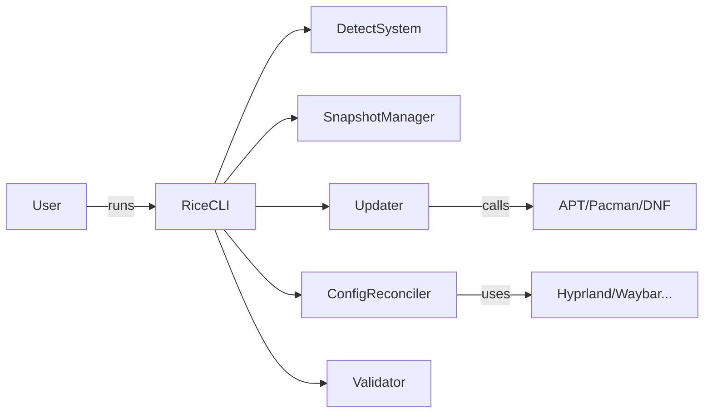
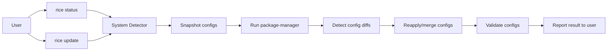
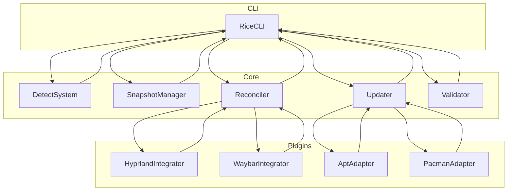
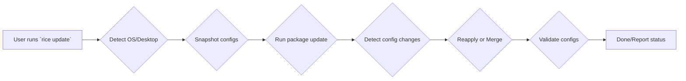
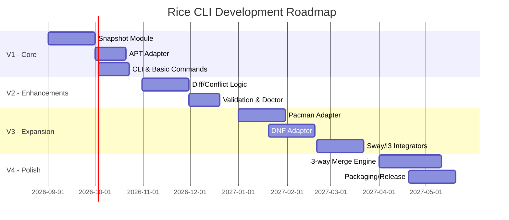

# Executive Summary  
Linux desktop enthusiasts who “rice” their setups (e.g. with Hyprland) often lose custom configurations when they update their system. Standard package updaters (APT, Pacman, DNF) tend to overwrite or create *.pacnew/.rpmnew files for modified configs. Existing solutions (dotfile managers or system snapshots) either require manual Git workflows or heavy full-system snapshots, which many users don’t adopt. We propose **rice**, a CLI tool that **protects user configs during updates**: it snapshots user config files, runs the update, then detects any config changes and re-applies the user’s customizations. The tool will initially target Ubuntu/Debian (APT) with Hyprland configs, then expand to other distros and desktop environments. 

**Key recommendations:** Use a **modular CLI architecture** (detection, snapshot, updater, config manager, validator) with plugin APIs for different desktops (Hyprland, Sway, etc.) and package managers (APT, Pacman, DNF). Start with a Python prototype for rapid development and Claude Code assistance, then refine or rewrite critical parts (e.g. in Rust/Go) as needed. Implement extensive testing (unit and integration) and CI/CD (GitHub Actions) to ensure reliability. Telemetry should be strictly opt‑in and minimal. License under MIT/Apache-2.0 to encourage community contributions, with clear contribution guidelines (GitHub Issues/PRs, code style, templates). Below is a comprehensive analysis and plan.

# 1. Problem Statement  
Users of riced Linux desktops (like Hyprland) often apply *pre-made dotfile configurations* to achieve a personalized look. However, running a system update can overwrite these custom files. For example, `apt-get upgrade` will prompt on modified configs (“What do you want to do? Y/I/N/O/D/Z”), leaving either new “.dpkg-dist” files or preserving old files. Similarly, Arch’s pacman creates `*.pacnew` files when user-modified `/etc` configs conflict, and Fedora’s DNF uses `*.rpmnew`. Beginners typically ignore these prompts and may inadvertently overwrite their tweaks. 

Common advice is to use a *dotfile manager* (e.g. GNU Stow, Chezmoi, yadm) or **Git** to track `~/.config`, or to take full system snapshots (e.g. Timeshift). But dotfile managers require extra learning and maintenance, and Timeshift (designed to protect `/` and `/etc`) actually **excludes** user home by default and uses gigabytes of space. Thus, there is a gap: **a simple update-wrapper tool** that automatically protects *only the user’s desktop config files*.

# 2. Target Users  
- **Linux “ricers” and power users** who customize their desktop (especially Hyprland/Wayland users) with dotfiles but lack in-depth sysadmin skills.  
- Users of distributions like **Ubuntu/Debian, Arch, Fedora, etc.** who want to safely update their system without losing a customized desktop.  
- **Newcomers** to Linux who clone “rice” dotfiles repos and expect `sudo apt upgrade` to just work, but then see broken setups.  
- Those who prefer CLI tools and automation over manual merge/restore steps.

# 3. Scope (CLI-only)  
This tool is a **CLI application only**—no GUI. It will wrap native package managers (apt, pacman, dnf, etc.) and operate entirely via terminal commands. This keeps it lightweight and appropriate for server or minimal-desktop users. All interactions (snapshots, diffs, conflicts) will happen in the shell, with clear messaging.  



# 4. Detailed Feature List  
1. **System & Desktop Detection.** Identify the OS and package manager (`apt`, `pacman`, `dnf`, etc.) and detect desktop environment or compositor (Hyprland, Sway, i3, etc.). This uses $XDG paths (e.g. `~/.config/hypr/hyprland.lua`) and checks for known executables.  
2. **Targeted Snapshot/Backup.** Before updating, *snapshot* the user’s customization files only (not whole system). This means copying `$HOME/.config/hypr/`, `~/.config/waybar/`, `~/.config/kitty/`, `~/.config/wofi/`, `~/.bashrc`, etc., into a versioned backup directory (like `~/.local/share/rice/snapshots/<timestamp>/`). We maintain a JSON manifest of backed-up files.  
3. **Package Update Runner.** Abstract the package manager into a common interface. E.g. for Ubuntu: `sudo apt update && sudo apt upgrade -y`. For Arch: `sudo pacman -Syu`. For Fedora: `sudo dnf update`. Capture stdout/stderr, exit codes, and list of upgraded packages for logs. Ensure non-interactive operation (possibly using `DEBIAN_FRONTEND=noninteractive`, `--force-confdef`, etc.), but still record if any config prompts occurred.  
4. **Diff/Change Detection.** After the update, compare the post-update files against the snapshot. For each tracked config file, see if it was changed, replaced, or removed. Simple `diff` or checksum comparison may suffice. Mark conflicts where the new version differs from both original and snapshot.  
5. **Layered Configuration Support.** Recommend (and optionally automate) splitting configs into “base” vs “user” layers. For example, use Hyprland’s `require`-based includes so that an upstream file can change but custom files are separate. The tool can *encourage* this: e.g. keep `$HOME/.config/hypr/hyprland.lua` as a thin loader that sources `$HOME/.config/hypr/user.lua`. This way, updates to the example config don’t clobber user settings.  
6. **Reapply/Merge.** If no conflicts, simply restore the snapshot files over the current ones to reapply custom settings. If conflicts are detected, present options: keep user version, accept package version, or launch a diff/merge interface. (This is an improvement over `apt`/`pacman` default behavior; see safety model below.)  
7. **Validation.** After reapplying, optionally test that the configuration is still valid. For example, run `hyprctl reload` or parse the config syntax. Report errors back to user. If validation fails, allow rollback to the snapshot.  
8. **Rollback & Recovery.** If something goes wrong during update or reapplication (e.g. update aborted, or validation fails), automatically restore the snapshot or leave the system in a known state. Provide a `rice restore` command to manually revert to a prior snapshot.  
9. **Status/Doctor Commands.** Additional subcommands like `rice status` or `rice doctor` can check “health” of config (all backed-up files exist, parse syntax, etc.). They can report out-of-date snapshots or lingering `.pacnew` files.  
10. **Interactive vs Unattended Modes.** By default, run non-interactively for scripted updates. Provide a verbose/interactive flag (`--prompt` or `--dry-run`) to inspect diffs or approve actions.

**Example CLI Commands:**  
```bash
rice snapshot   # Create a manual snapshot of configs.
rice update     # Run protected system update (the main command).
rice restore    # Restore last snapshot (in case of error).
rice diff       # Show differences between last snapshot and current.
rice status     # Show system type, configs tracked, last snapshot/update status.
rice doctor     # Check all configs are present and valid.
```

# 5. Failure Modes & Safety Model  
- **Unwritable Files/Permissions:** The tool should *never* overwrite `/etc` or system files without explicit sudo. We only backup/restore user-owned config files (in `$HOME`). Any root actions (apt, pacman) are done separately. Use subprocess carefully; do not run arbitrary scripts from config.  
- **Interrupted Updates:** If the update command fails (network, power loss), we must detect non-zero exit and **not** attempt to reapply configs. Instead, allow retry or rollback.  
- **Merge Conflicts:** If the upstream config changed in a way that conflicts with user changes (all three states different, per Pacman rules), automated merging may break semantics. In such cases, we **warn the user** and fall back to manual intervention (show diff or open in editor). We do **not** blindly overwrite in conflict, to avoid subtle config loss.  
- **Validation Failures:** If reapplying configs leads to errors (e.g. Hyprland doesn’t start), we detect this and offer to restore the snapshot.  
- **Tool Crashes:** Maintain idempotency: if `rice update` is re-run, it should detect partial state and either resume or restore previous snapshot.  
- **User Mistakes:** We will design the CLI output to be clear (“Your Hyprland config changed; do you want to keep your old settings or accept the new ones?”) to avoid confusion. By default, we may *favor the user’s version* (per survey of pkg managers).

**Safety Summary:** Always work on copies of user files, never delete originals until successful completion, and have a fallback snapshot. E.g., using APT’s `--force-confold` can keep user files, but we also archive them externally. Pacman’s use of `.pacnew` inspires our design: create our own snapshot and only merge changes we explicitly approve.

# 6. Security & Permissions  
- The tool runs as the regular user, only elevating to `sudo` for the system update portion. It should prompt once for sudo (or use cached credentials).  
- It should verify it’s updating the **correct system** (e.g. match OS ID) to prevent misconfiguration.  
- **No credentials leakage:** Unlike APT which might prompt for sudo, `rice` should not mishandle sudo passwords or store them.  
- **Telemtry:** If implemented, it must be opt-in (disabled by default) and not send any sensitive data (just anonymized stats or version usage).  
- **Dependencies:** If using external tools (git, diff, etc.), ensure they are standard and secure. All file operations in `$HOME` should be permission-checked.  
- **Auditing:** Log actions and keep the logs in a local file (with user consent), so the user can audit what happened.

# 7. UX Flows & CLI Commands  
The primary workflow is (pseudocode):

```text
$ rice update
Rice 1.0.0 - Protected Update CLI

Detecting environment...
✔ Detected Ubuntu 24.04
✔ Detected Hyprland (config at ~/.config/hypr/hyprland.lua)
Backing up configurations...
✔ Snapshot saved (2026-08-21T12:00:00)

Running system update (apt)...
┌─ Upgrading packages (37 upgrades) ─────────────────────────────
│ [##############--------------]  53% 
└───────────────────────────────────────────────────────────────

Detecting changed configs...
⚠ Hyprland config changed (monitor resolution)
Applying custom configs...
✔ Restored ~/.config/hypr/hyprland.lua from snapshot

Validation: Hyprland config OK.
✔ Update completed successfully. Your system is up-to-date and your rice is intact.
```

If a conflict arises, the tool would output something like:

```text
⚠ Conflict detected in Hyprland config:
    - Your version has `monitor=1920x1080@144`
    - Package version has `monitor=1920x1080@165`
What would you like to do?
1) Keep my version
2) Use package’s version
3) Show diff
4) Abort update
>
```

And proceed based on user choice.  



# 8. Telemetry & Privacy  
**Telemetry:** If included, only on an **opt-in** basis (e.g. user runs `rice config --enable-telemetry`). Data collected might be anonymous usage metrics (e.g. frequency of updates, error rates) to help improve the tool. No personal data, no shell histories, no config contents. Examples: send only “Hello from Ubuntu 24.04 with Hyprland” or generic event counts. (Optionally use a standard telemetry service or a simple JSON ping to a project server.)  

Privacy must be explicit: default OFF, and clearly documented. Provide a `rice config` command to toggle it. Use a minimal, privacy-respecting analytics approach (no external cookies, no PII).

# 9. Testing Strategy  
- **Unit Tests:** For each module (snapshot, updater wrapper, diff logic, config backup/restore). For example, mock a directory with dummy Hyprland config and test that `snapshot` copies it, or that `detectDiff` identifies changes. Use `pytest` (or similar) to automate.  
- **Integration Tests:** Use containerized VMs or chroots to simulate an update. For Ubuntu, create a Docker container, install a dummy “package” that modifies a test config, then run `rice update` and verify restoration. Or use a local APT repository with packages. Similarly, test on Arch (pacman) and Fedora (dnf) containers.  
- **Simulated Failure Tests:** Force errors (e.g. corrupt config, partial update) and ensure `rice` safely rolls back or prompts.  
- **CI Regression:** On each commit, run tests on all supported platforms (Ubuntu latest, Arch, Fedora) in CI.  

Automated test plan:
```bash
pytest tests/unit/*.py     # unit tests
docker run ubuntu:24.04 /bin/bash -c "run rice update"  # integration
docker run archlinux /bin/bash -c "run rice update"
```
Check that after each test, user configs match pre-update state.

# 10. CI/CD and Packaging  
- Use **GitHub Actions** (or similar) for Continuous Integration: run linters (flake8/black for Python), unit tests, build packaging. 
- **Release Process:** Tag semantic versions (vX.Y.Z). On release, build and publish assets: e.g. PyPI package, Homebrew formula, Arch AUR submission, or GitHub Release binaries (for Go/Rust builds).  
- **Artifact Distribution:** For Python, support installation via `pip install rice-cli`, and optionally provide a `.deb` or `.rpm` (via fpm or native packaging). For compiled languages, provide static binaries (leveraging their static linking for portability).  
- **Documentation:** Host on GitHub Pages or ReadTheDocs: CLI manual, example configs, roadmap. Include CHANGELOG, upgrade notes.  

# 11. Maintenance & Community  
- **License:** Adopt a permissive license (MIT or Apache 2.0) to maximize use. E.g. `MIT` (simple, common) or `Apache-2.0` (more patent-safe). This encourages community contributions.  
- **Contribution Guidelines:** Provide CONTRIBUTING.md with:
  - Code style (PEP8 or standardized for chosen language).
  - Git workflow (feature branches, PR reviews).
  - Issue/pull request templates.
  - Code of Conduct (if needed).
- **Community Engagement:** Use GitHub Issues to track feature requests and bugs. Encourage users to file issues on update failures. Possibly create a chat (Matrix/Discord) for the community.
- **Documentation:** Keep docs updated with supported integrations (Hyprland, Sway, etc.). Example dotfile repos.

# 12. Tech Stack Recommendation  
- **Language:** **Python 3** for the core CLI (rapid development, wide library support, easy to code-review and auto-generate with Claude). Python allows quick prototyping (e.g. using [Click](https://click.palletsprojects.com/) or [Typer](https://typer.tiangolo.com/) for CLI) and easy text processing. For later high-performance/statically-linked needs, consider a follow-on rewrite in Go or Rust.  
- **CLI Framework:** [Click](https://click.palletsprojects.com/) or [Typer](https://typer.tiangolo.com/). Typer (based on Click) offers auto-generated help text.  
- **Config Parsing:** Use standard JSON/YAML libraries (`json`, `yaml`) for manifest and any UI themes. Could use [toml](https://pypi.org/project/toml/) if needed.  
- **Diff/Merge:** Python’s `difflib` for simple text diff. For advanced 3-way merge, use external `diff3` tool or a library like [python-Levenshtein](https://pypi.org/project/python-Levenshtein/) or [unidiff](https://pypi.org/project/unidiff/).  
- **Testing:** [pytest](https://pytest.org) for unit tests. Use [pexpect](https://pexpect.readthedocs.io/) or [subprocess.run] to simulate CLI.  
- **Packaging:** [Poetry](https://python-poetry.org/) or [setuptools](https://setuptools.readthedocs.io/) for Python packaging. For distribution, build wheels and SourceTarballs.  
- **Logging:** Python’s `logging` module (with nice CLI output).  
- **Security:** No root needed except on update; use `subprocess.run(["sudo", ...])` with care.  
- **Claude Code:** We'll use Claude Code to generate module stubs and implement logic, guided by precise prompts. For example, prompt it: *“Write a Python class `SnapshotManager` that copies a given list of file paths to a timestamped directory, recording a manifest.json.”* and verify with tests.

**Alternatives:** Go could be chosen for a single static binary, but the learning curve is higher and Claude Code support for Go is less mature. Rust offers safety and speed, but significantly longer dev time. Given our reliance on code generation and quick iteration, Python is best for V1/V2.

# 13. Project Structure & Plugin API  

**Example structure:**  
```
rice/                 # root Python package
├── cli.py            # CLI entrypoint (using Click/Typer)
├── core/             # core modules
│   ├── system.py         # OS/desktop detection
│   ├── snapshot.py       # snapshot & restore logic
│   ├── updater.py        # package manager interface
│   ├── reconciler.py     # diff/merge logic
│   ├── validator.py      # config validation (e.g. syntax check)
│   └── config/           # config utilities (manifest, logging)
├── integrators/      # desktop config plugins
│   ├── hyprland.py       # detect and handle Hyprland configs
│   ├── sway.py           # (future)
│   └── common.py         # abstract base class for integrators
├── pkgmanagers/      # package manager adapters
│   ├── apt.py            # apt implementation
│   ├── pacman.py         # pacman implementation
│   └── dnf.py            # dnf implementation
├── tests/            # test suite
│   ├── unit/
│   └── integration/
├── README.md
└── pyproject.toml or setup.py
```

**Plugin API (illustrative):**  
```python
# integrators/common.py
class DesktopIntegrator:
    def detect(self) -> bool: ...
    def list_config_files(self) -> List[Path]: ...
    def backup(self, dest: Path) -> None: ...
    def restore(self, src: Path) -> None: ...
    def validate(self) -> bool: ...
```
Each plugin (e.g. `HyprlandIntegrator`) implements these. The core reconciler will loop over enabled integrators to snapshot and restore.

```python
# pkgmanagers/base.py
class PackageManager:
    def update(self) -> UpdateResult: ...
    def get_changed_configs(self) -> List[Path]: ...
```
Each `APTManager`, `PacmanManager`, `DNFManager` implements `update()` (running the proper commands) and parse its output to find changed config files (though changed configs are handled in snapshot, they might also detect if dpkg/apt prompted).

This abstraction lets `rice` operate generically: it calls `pm.update()` and `integrator.backup()`, etc.

# 14. Implementation Roadmap & Milestones (V1–V4)  

| Milestone | Description | Duration | Deliverables & Acceptance Tests |
|----------|-------------|----------|---------------------------------|
| **V1:** Basic MVP (Ubuntu + Hyprland) | - Snapshot & restore functionality (copy config files and manifest).<br>- APT adapter for `update` (using `apt update && apt upgrade -y`).<br>- CLI skeleton (`rice update`, `rice snapshot`, `rice restore`, `rice status`).<br>- Simple diff detection (mark changed files, no auto-merge). | 4–6 weeks | **Deliverables:** Core modules implemented, CLI working. <br>**Test:** On Ubuntu container, simulate an update (e.g. install a dummy Hyprland config package), run `rice update`, and verify user config matches pre-update version. |
| **V2:** Conflict handling & UX | - Implement diff-based conflict detection. <br>- Interactive prompts for conflicts (keep old vs new).<br>- Basic config validation (call `hyprctl reload` to catch syntax errors).<br>- Add telemetry opt-in (if decided).<br>- Unit tests for reconciling logic. | 4–6 weeks | **Deliverables:** Conflict scenario handled, validation works.<br>**Test:** Create a scenario where upstream config differs (e.g. change `monitor`), run `rice update`, ensure prompt appears, user can choose an option, and the chosen version is applied correctly. Validate detection of invalid config (e.g. typo causing reload fail) and rollback. |
| **V3:** Multi-distro & More configs | - Add Pacman adapter for Arch (with handling of `.pacnew`).<br>- Add DNF adapter for Fedora/enterprise (with `.rpmnew`).<br>- Support Sway/i3/other desktops (detect `~/.config/sway/config` etc).<br>- Enhance snapshot to include more dotfiles (GTK, ~/.bashrc, etc.).<br>- Packaging: setup PyPI distribution, AUR or brew instructions. | 6–8 weeks | **Deliverables:** Arch & Fedora support, at least one additional desktop. Packaging scripts. <br>**Test:** On Arch Docker, modify an `/etc` config, run `rice update`, ensure `.pacnew` logic or our snapshot preserves user file. Similarly for Fedora with a `.rpmnew` scenario. Test on Sway or i3 by backing up and restoring a sample sway config. |
| **V4:** Polish & Scale | - Intelligent 3-way merge or advanced reconciliation (possibly using git-style merge) for configs. <br>- TUI or enhanced CLI output (colored, etc.).<br>- `rice doctor` to audit configurations.<br>- Comprehensive tests and documentation. <br>- Project website and continuous deployment (homebrew tap, snapcraft, etc). | 6–8 weeks | **Deliverables:** Advanced merge, health checks, polished UI. <br>**Test:** Complex multi-file scenario where some configs can partially merge. Confirm `rice doctor` finds missing files or syntax errors. Ensure all components are stable under repeated use. |

Each milestone breaks into tasks that can be delegated to Claude Code via targeted prompts. For example, *Milestone V1* might be split into “Snapshot Module” and “APT Updater Module”. We’d provide Claude Code with:

- **Prompt:** “Implement `SnapshotManager.snapshot(files: List[Path]) -> SnapshotID` in Python. It should copy given files into `~/.local/share/rice/snapshots/<timestamp>/` and return that ID.”  
- **Unit Test Spec:** Given temp directory with dummy configs, calling snapshot should create a folder and manifest listing those files.  

We keep similar prompt/test spec for the `apt` module: “Run `sudo apt update` and `sudo apt upgrade` and return success. Provide a dry-run mode for tests.”  

By working incrementally, we ensure each part is testable.

# 15. Required Inputs for Claude Code per Milestone

For each subtask, prepare:

- **Prompts:** Clear instructions and desired behavior. E.g., for the “backup script”, prompt: *“Write a Python function that, given a list of config file paths, creates a backup directory (with current timestamp) under `~/.local/share/rice/snapshots/` and copies each file there. It should skip files that don’t exist and log the action.”*  
- **Unit Test Specs:** Define inputs and expected outputs. E.g., “Given files `~/.config/test.conf` and `~/.config/foo/bar`, snapshot should create directory with those files. After run, opening the snapshot’s manifest.json should list them.”  
- **Example Files:** Provide sample config files or simulate a small directory tree so Claude Code can reason. E.g. `touch ~/.config/hypr/hyprland.lua` with example content for Hyprland, or YAML list of file paths.  
- **For Package Manager Adapters:** supply examples of command output or logs. E.g., for Pacman, include sample `.pacnew` detection logic by giving an example package list.

This “input package” approach guides Claude Code to generate the needed code for each piece. The prompts should emphasize safety (no destructive ops without backup) and correctness. Combine with iterative reviews of Claude’s output and running the tests.

# 16. Comparative Tables

## Approaches to Preserving Configs

| Approach               | Description                                            | Pros                                               | Cons                                                          |
|------------------------|--------------------------------------------------------|----------------------------------------------------|---------------------------------------------------------------|
| **Backup-and-Restore** | Copy all user configs to a temp location, update, then copy them back. | Simple to implement; works with any config format. | Blindly overwrites entire files; no merging of incremental changes. If update modifies config keys, user changes may be lost or duplicated. Requires caution on timing. |
| **Layered (Sourcing)** | Split configs into “base” and “user” files using includes (e.g. Hyprland’s `require`). Preserve only the user layer across updates. | User changes are isolated from upstream files. Updates to base config don’t overwrite user tweaks. | Requires users to structure their configs and update tools to apply layered logic. Less transparent to casual users. |
| **Git-based Dotfiles** | Keep all config in a Git repo (local or bare), use symlinks or scripts (Chezmoi, Stow) to install. Use `git commit` before updates. | Full version control history; easy to track and merge changes. Works across machines. | Steeper learning curve. Not specifically designed to integrate with system updates. Users must remember to commit and handle merges manually. |

## Package-Manager Config Handling

| Package Manager | Backup Suffix  | Default Behavior on Update                                             | Citation     |
|-----------------|----------------|-----------------------------------------------------------------------|-------------|
| **APT/Dpkg**    | `.dpkg-dist` (new), `.dpkg-old` (old)  | Prompts user on modified config. Default is **keep current** (new version saved as `.dpkg-dist`). Can force behavior via `--force-confold` or `--force-confnew`. | [43] |
| **Pacman**      | `.pacnew`, `.pacsave` | If a config was modified, installs new config as `*.pacnew` and leaves user file untouched. No prompts. Admin must manually merge. | [53] |
| **DNF/RPM**     | `.rpmnew`, `.rpmsave` | Similar to Pacman: modified configs left as-is, new version placed in `.rpmnew`. Usually prompts only if marked, but typical Fedora practice is `.rpmnew`. | [55] |

These comparisons highlight that none of the package managers fully solves the “ricing” problem. Our tool will unify these behaviors under one interface.

# 17. Diagrams 

**Architecture Overview:** A high-level component diagram showing interactions:  
  


**CLI Flow (simplified):**  


**Project Timeline (Gantt):**  


*(Dates and durations are estimates. Dependencies are indicated by “after”.)*

# 18. Sample CLI Help & Transcript  

**Sample `rice --help`:**  
```bash
Usage: rice [OPTIONS] COMMAND [ARGS]...

A tool to protect your Linux desktop config during system updates.

Options:
  --version       Show the rice version and exit.
  -v, --verbose   Increase output verbosity.
  --no-color      Disable colored output.
  --help          Show this message and exit.

Commands:
  snapshot   Create a snapshot of current configuration files.
  update     Run system update with config protection.
  restore    Restore the last snapshot of configuration.
  status     Show detected system, configs, and last snapshot info.
  diff       Show differences between snapshot and current configs.
  doctor     Check and diagnose your configuration files.
  config     Configure rice (enable telemetry, etc.).
```

**Example Run Transcript:**  
```
$ rice status
Rice CLI 0.1.0 - Configuration Status
Detected: Ubuntu 24.04 (apt), Hyprland
Tracked configs (5 files):
 - ~/.config/hypr/hyprland.lua
 - ~/.config/waybar/config
 - ~/.config/waybar/style.css
 - ~/.config/kitty/kitty.conf
 - ~/.bashrc
Last snapshot: 2026-08-15 10:00:00 (5 files backed up)
Last update: 12 days ago (successful)

$ rice update
Rice CLI 0.1.0 - Protected System Update
✔ Snapshot created: 2026-08-21-134501
Updating packages (apt)...
⇢ 35 upgraded, 2 newly installed. (This will take 2m)
Applying your custom configs...
⚠ ~/.config/hypr/hyprland.lua changed by update.
Your:   monitor=DP-1,1920x1080@144
Update: monitor=DP-1,1920x1080@165
Choose action: [K]eep my version, [U]se new, [D]iff?
K
✔ Restored hyprland.lua from backup.
Validation: Hyprland config OK.
✔ System update complete. Your rice is intact!
```

# 19. License and Contribution Guidelines  

- **License:** Recommend the **MIT License** (or Apache 2.0). Both are OSI-approved permissive licenses. MIT is very simple, while Apache adds patent grant clauses. Either choice is fine; MIT is more common for small tools.  
- **Contribution Guidelines:** Include a `CONTRIBUTING.md` stating:
  - Use consistent coding style (Black or PEP8 for Python).
  - Issue tracker usage (labeling bugs vs feature requests).
  - PR workflow (fork, branch, PR, CI passing, review).
  - Code reviews and maintainers’ response time.
  - Encouragement of testing and documentation updates with PRs.

**In summary**, this plan outlines building *rice* as a robust CLI tool to preserve Linux desktop customizations through updates. It leverages known patterns (APT/DNF/Pacman config handling) and modern dotfile best practices, but packages them into an easy one-command solution. Each development phase is test-driven and documented, and the architecture is modular for future growth. With Claude Code, we can accelerate implementation by generating boilerplate and modules, while focusing human effort on design and testing. 

